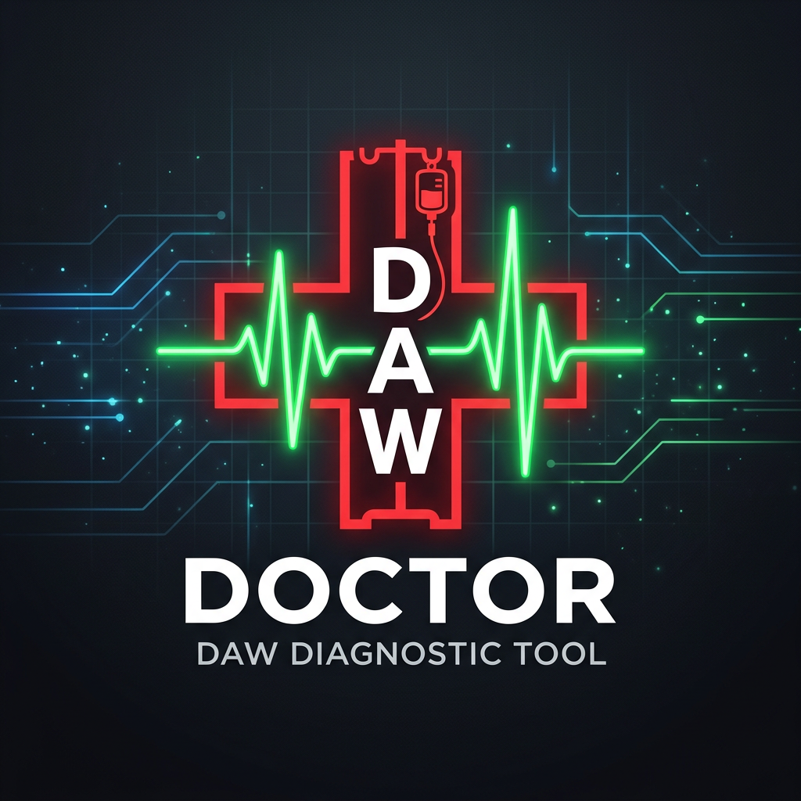

# ⚕ DAW Doctor

> **Your DAW is sick. Let's fix it.**



OBD diagnostics for your DAW. Catch CPU spikes, latency issues, and audio dropouts before they kill your session.

> **CPU impact: 0% when idle. Runs only when you ask it to.**
> No background process. No daemon. No scheduler. It wakes up, scans, prints results, and exits. Your session is never touched.

*Zone Out. Dial In. Create.*

---

## What It Does

DAW Doctor is a macOS diagnostic tool built for Ableton Live producers. Think of it like a code reader for your car — except for your studio. Run a scan, get a diagnosis, get back to making music.

No more guessing why your session is spiking. No more Googling "Ableton high CPU fix" at 2am mid-session.

---

## What It Actually Catches

| Problem | What DAW Doctor Finds |
|---|---|
| Plugin overload | Which device is spiking, and by how much |
| Sample rate mismatch | Driver vs. project vs. interface conflicts |
| Buffer pressure | Too tight for your track count, too loose for latency-sensitive work |
| Disk bottleneck | Slow read speeds killing sample playback |
| Thermal throttling | CPU pulling back clock speed mid-session |
| Background process spikes | What else is eating your headroom while you produce |
| Audio dropout history | How many, how often, and likely why |

---

## Features

- 🔍 **Full System Scan** — CPU, RAM, audio buffer, sample rate, dropouts, thermal state
- 🎛 **Ableton Project Analyzer** — scans your `.als` file and flags what's eating your CPU
- 🚨 **Background Monitor** — watches your system and sends macOS notifications when things go wrong
- 🛠 **Fix Commands** — doesn't just tell you what's wrong, gives you the shell command to fix it
- 📊 **Session Reports** — export a full diagnostic report with timestamp
- 💡 **Tips Mode** — producer-focused tuning tips for a clean, fast session

---

## Install

```bash
git clone https://github.com/papjamzzz/daw-doctor.git
cd daw-doctor
./setup.sh
```

That's it. Setup installs dependencies and creates a clickable `DAW Doctor.app` in your Applications folder.

---

## Usage

**Click the app** in your Applications folder or Dock.

Or from Terminal:
```bash
abl
```

**Analyze an Ableton project:**
```bash
./run.sh analyze
```

**Run as a background monitor:**
```bash
./run.sh monitor
```

---

## Requirements

- macOS 11+
- Python 3.8+
- Ableton Live (any version)

---

## Why I Built This

Session is running slow. Plugins stuttering. Buffer maxed out. You're in a creative flow and your machine is the one thing killing it.

DAW Doctor gives you answers in seconds so you can get back to what matters.

---

*Built for producers, by a producer.*
*Free. Open source. No fluff.*


---

## Part of Creative Konsoles

Built by [Creative Konsoles](https://creativekonsoles.com) — tools built using thought.

**[creativekonsoles.com](https://creativekonsoles.com)** &nbsp;·&nbsp; support@creativekonsoles.com
